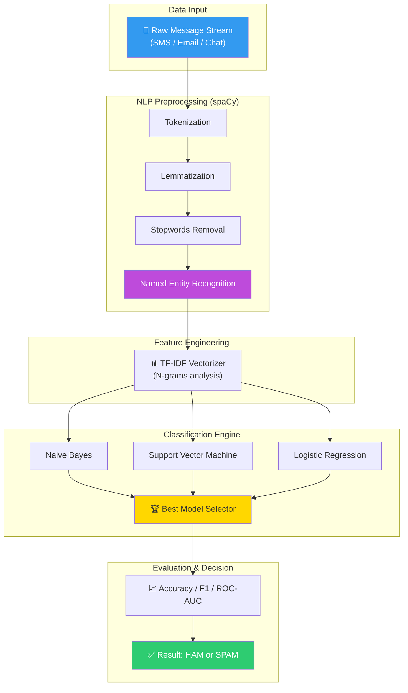
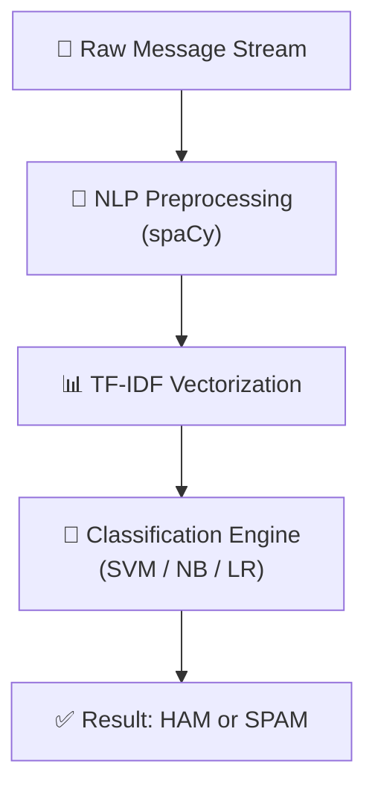

# 🛡️ SpamGuard: Enterprise NLP Content Governance & Fraud Detection

<p align="center">
  
  
  
  
  
</p>

**SpamGuard** è un sistema di Content Governance basato su Natural Language Processing (NLP) progettato per l'identificazione automatica di comunicazioni fraudolente o non sollecitate. Il progetto implementa una pipeline di Machine Learning end-to-end che trasforma flussi testuali grezzi in decisioni categorizzate, garantendo un'accuracy del **97%** e un F1-score di **0.96**, ideale per contesti di cybersecurity e moderazione contenuti su larga scala.

## 🏢 Valore Enterprise & Settori di Applicazione

| Settore / Ambito | Rilevanza & Benefici |
|-------------------|-----------|
| **Cybersecurity & Security** | Content moderation e rilevamento preventivo di attacchi di phishing e comunicazioni anomale. |
| **Customer Support Automation** | Classificazione automatica di email e ticket in entrata, riducendo il carico di lavoro manuale e migliorando i tempi di risposta. |
| **Financial Services** | Text-based Fraud Detection: identificazione di pattern sospetti in comunicazioni transazionali o chatbot. |
| **Digital Platforms** | Governance dei contenuti generati dagli utenti (UGC) per garantire la qualità e la sicurezza della community. |

---

## 🎯 Executive Summary & Valore di Business
SpamGuard risolve il problema della saturazione dei canali di comunicazione, proteggendo gli utenti e le infrastrutture aziendali da spam e potenziali minacce testuali.

### 🏛️ 1. Pipeline NLP Industriale (spaCy & NLTK)
* **Preprocessing Avanzato:** Utilizzo di **spaCy** per un'analisi linguistica profonda, includendo tokenizzazione, lemmatizzazione e Named Entity Recognition (NER) per identificare entità sensibili nel testo.
* **Feature Extraction Ottimizzata:** Implementazione di vettorizzazione **TF-IDF** con tuning degli iperparametri per catturare l'importanza semantica dei termini minimizzando il rumore di fondo.

### 🤖 2. Machine Learning & Model Selection
* **Benchmarking Comparativo:** Confronto rigoroso tra diversi algoritmi di classificazione (Naive Bayes, SVM, Logistic Regression, Random Forest) per identificare il modello con il miglior trade-off tra velocità di inferenza e precisione.
* **Evaluation Strategica:** Oltre all'accuratezza, il sistema viene valutato tramite matrici di confusione e curve ROC-AUC, assicurando una minimizzazione dei falsi negativi (spam non rilevato) e dei falsi positivi (comunicazioni legittime bloccate).

### ⚙️ 3. Scalabilità ed Integrazione
* **Modularià:** Architettura progettata per essere esportata (via joblib/pickle) e integrata in microservizi di inferenza real-time o pipeline batch.
* **Audit Trail:** Il sistema produce report di valutazione dettagliati, fondamentali per il monitoraggio continuo delle performance in produzione (MLOps).

---

## 🏗️ Architettura del Sistema



## 🛠️ Stack Tecnologico

| Layer | Tecnologia | Ruolo |
|:------|:-----------|:-----|
| 🐍 **Language** | Python 3.8+ | Core development |
| 🧪 **NLP** | spaCy / NLTK | Advanced Linguistics & Preprocessing |
| 🤖 **ML Framework** | scikit-learn | Model training & Evaluation |
| 📊 **Analysis** | pandas / NumPy | Data manipulation |
| 📈 **Visualization** | Seaborn / Matplotlib | Performance visualization |

## 🚀 Setup

```bash
# Clone e navigazione
git clone https://github.com/sylver86/06-spam-detection-system-nlp-python.git
cd 06-spam-detection-system-nlp-python

# Installazione dipendenze e modelli linguistici
pip install -r requirements.txt
python -m spacy download en_core_web_sm

# Esplorazione
jupyter notebook notebooks/Progetto_Spam_Filter.ipynb
```

<br><br>

*Progettato e sviluppato da Eugenio Pasqua.*

---

# 🇬🇧 ENGLISH VERSION

# 🛡️ SpamGuard: Enterprise NLP Content Governance & Fraud Detection

<p align="center">
  
  
</p>

**SpamGuard** is a Content Governance system based on Natural Language Processing (NLP) designed for the automatic identification of fraudulent or unsolicited communications. The project implements an end-to-end Machine Learning pipeline that transforms raw textual streams into categorized decisions, ensuring **97% accuracy** and an **0.96 F1-score**, ideal for large-scale cybersecurity and content moderation contexts.

## 🏢 Enterprise Value & Application Sectors

| Sector / Domain | Relevance & Benefits |
|-------------------|-----------|
| **Cybersecurity** | Content moderation and early detection of phishing attacks and anomalous communications. |
| **Customer Support** | Automatic classification of incoming emails and tickets, reducing manual workload and improving response times. |
| **Financial Services** | Text-based Fraud Detection: identifying suspicious patterns in transactional communications or chatbots. |

---

## 🏗️ System Architecture



## 🧰 Technology Stack

`Python 3.8+` · `spaCy` · `NLTK` · `scikit-learn` · `TF-IDF` · `pandas`

<br><br>

*Designed and developed by Eugenio Pasqua.*
